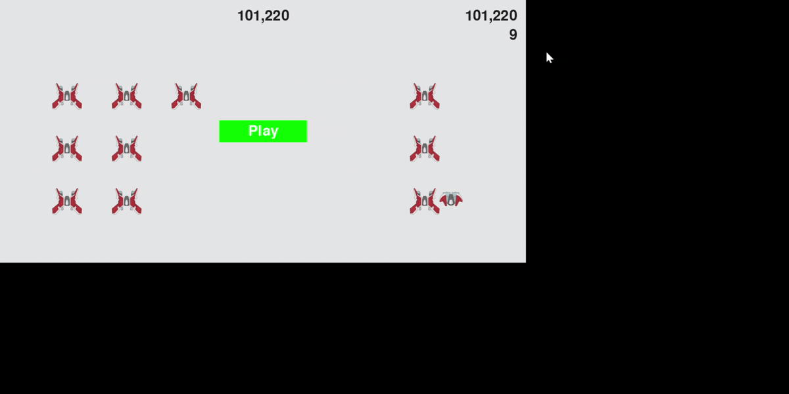
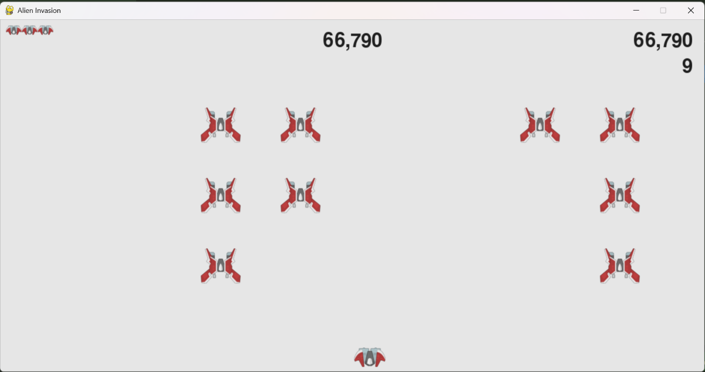

# 👾 Alien Invasion

A classic arcade-style shooter built with **Python** and **Pygame**, based on the project from _Python Crash Course_ by Eric Matthes — extended with several original features beyond the book.




> Part of my journey building small things that make everyday life a little better — [more projects here](https://github.com/khoahdinh).

## 🎮 Gameplay

Pilot your ship, blast down waves of aliens, and survive as long as you can. Clear a fleet and a new (faster) one spawns right after.

## 🕹 Controls

| Key                     | Action           |
| ----------------------- | ---------------- |
| `↑` `↓` `←` `→`         | Move the ship    |
| `Space`                 | Fire             |
| `P`                     | Start a new game |
| `Q`                     | Quit             |
| Mouse click on **Play** | Start a new game |

## 🚀 Getting Started

```bash
# Clone the repo
git clone https://github.com/lucienhoang/alien-invasion.git
cd alien-invasion

# Install dependencies
pip install -r requirements.txt

# Run the game
python alien_invasion.py
```

## 📁 Project Structure

```
alien-invasion/
├── alien_invasion.py     # Main game loop
├── game_functions.py     # Event handling, collisions, fleet logic
├── settings.py           # Game settings (static & dynamic)
├── game_stats.py         # Tracks score, level, ships left
├── scoreboard.py          # Renders score, high score, level, lives
├── ship.py                # Player ship class
├── alien.py                # Alien class
├── bullet.py               # Bullet class
├── button.py                # Play button class
├── images/                  # Game sprites
└── requirements.txt
```

## ✨ Beyond the Book

While following _Python Crash Course_, I extended the original project with a few features of my own:

- **4-direction movement** — the book only covers left/right; added up/down movement with matching edge-detection logic
- **`P` key shortcut** to start the game, refactored alongside the Play button into a shared `start_game()` function to avoid duplicated logic
- **Scaled life icons** in the scoreboard — resized independently from the actual ship sprite using `pygame.transform.smoothscale`
- **Fixed frame-rate cap** (`clock.tick(60)`) — without it, alien speed unintentionally scaled with CPU load instead of staying consistent across machines

## 🧠 What I Learned

- Realistic development process: write the simplest possible code first, then refactor as the project grows more complex — it doesn't need to be perfect from the start.
- Quick way to understand a class: look at `__init__()` to see what input it needs (constructor parameters) and what attributes it creates — the fastest way to grasp what a class does without reading all the code.
- Game speed must be independent of machine speed: always use `clock.tick(FPS)` in the main loop. Without it, every object's movement speed depends on how busy the CPU is at that moment, causing the game to feel inconsistently fast or slow.

## 🛠 Built With

- Python 3
- [Pygame](https://www.pygame.org/)

## 📚 Reference

- _Python Crash Course_ by Eric Matthes
- [📄 My project notes — code breakdown & lessons learned (PDF)](docs/alien_invasion_project_notes.pdf)

---

_Originally built while working through Python Crash Course — moved to its own repo to showcase as a standalone project._
