## 🖼 Sample Output

**Matplotlib**

- Random walk visual:

  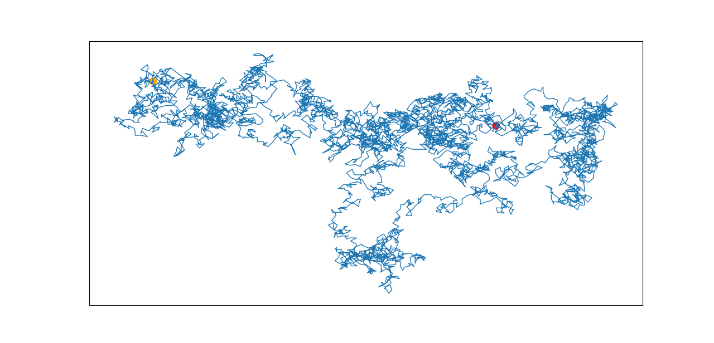

- Cube numbers:

  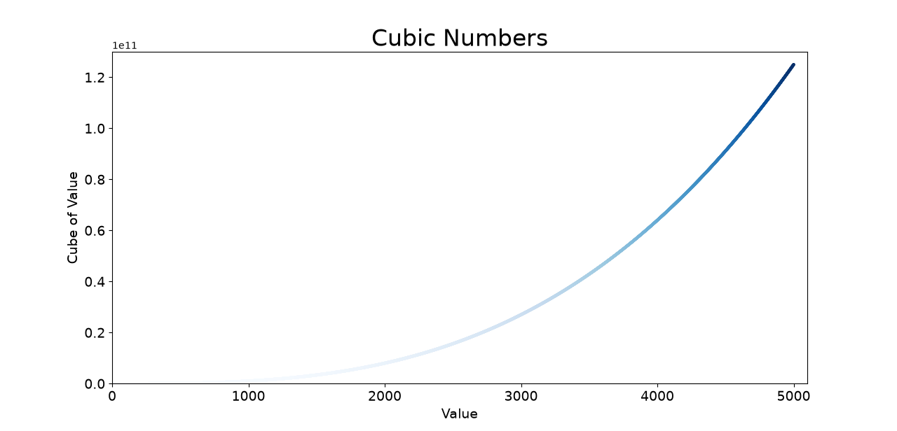

- Die visual:

  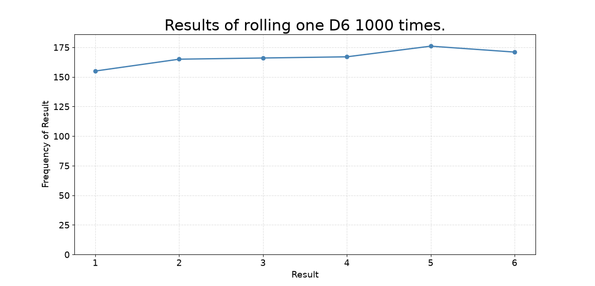

- Mpl Squares:

  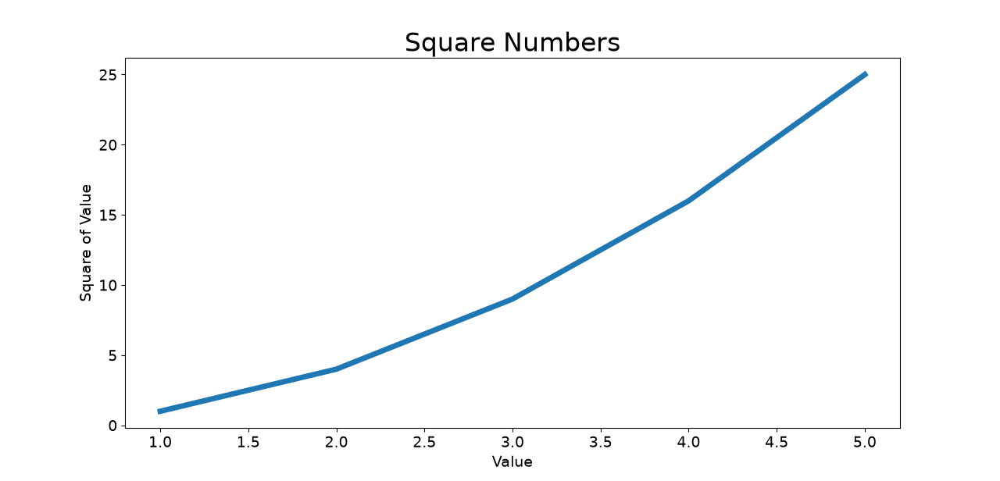

- Scatter Squares:

  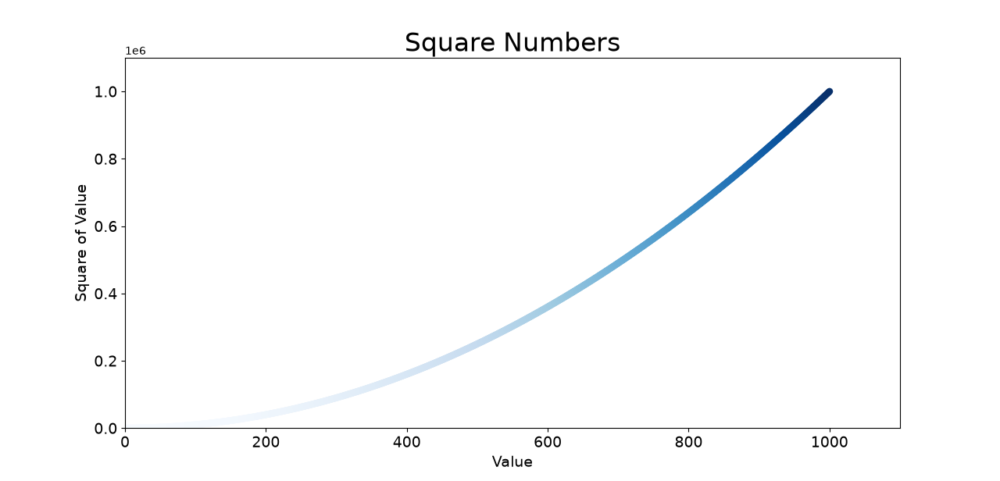

**Pygal — dice roll frequency**

- Die visual:

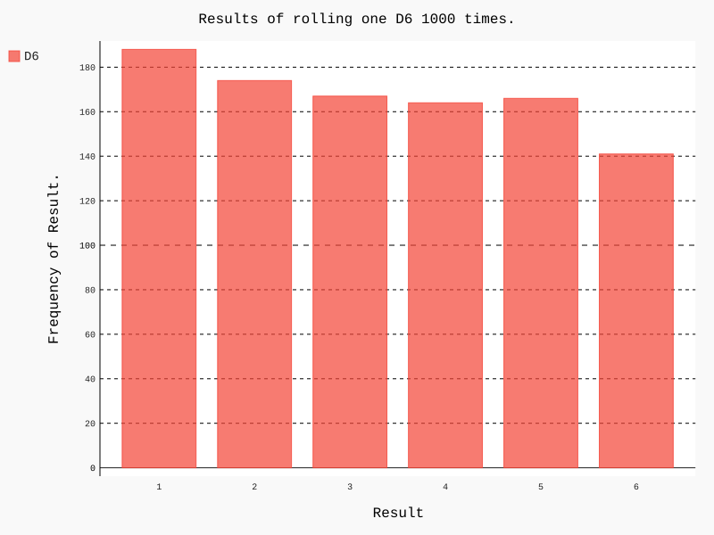

- Dice visual:

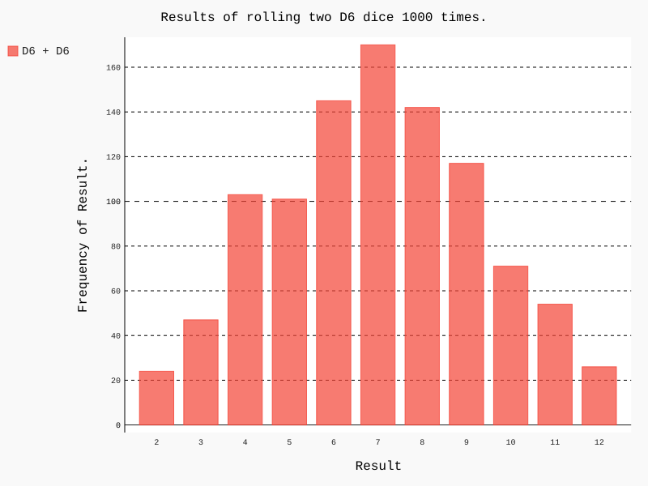

- Different dice visual:

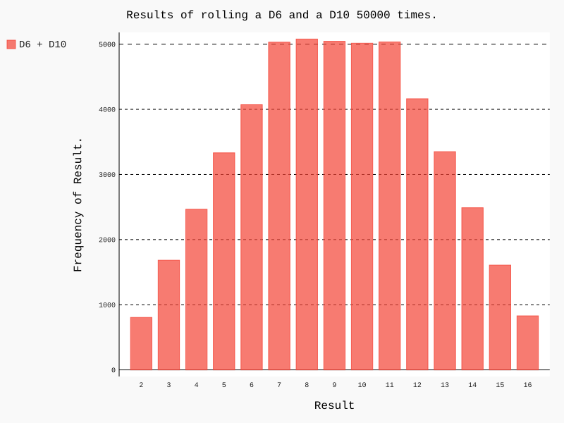

- Two D8s visual:

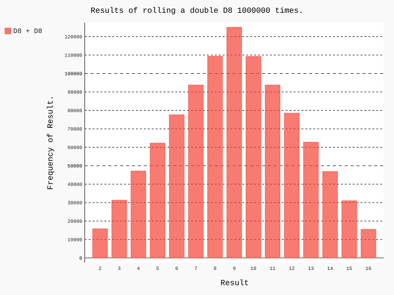

- Three dice visual:

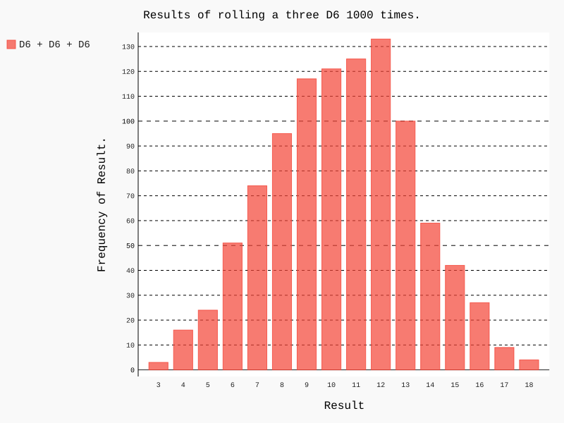

- Multiplication dice visual:

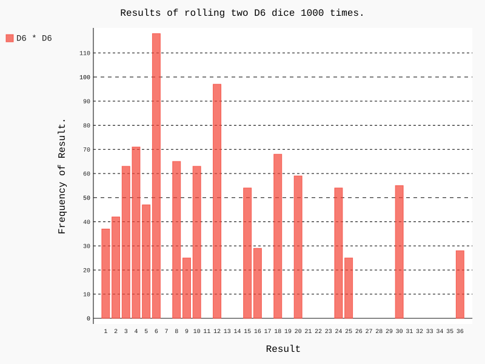

## 🧠 Matplotlib vs. Pygal

|              | Matplotlib                                                                  | Pygal                                                                                               |
| ------------ | --------------------------------------------------------------------------- | --------------------------------------------------------------------------------------------------- |
| Workflow     | Prepare `x`, `y` → `plt.plot(x, y)` → configure title/labels → `plt.show()` | Create chart object → configure (title, `x_labels`, axis titles) → `add(data)` → `render_to_file()` |
| Mental model | "Plot `x` and `y` onto a figure"                                            | "Feed a dataset into a chart"                                                                       |
| Output       | Static image, shown in a window (`plt.savefig()` needed to export)          | `.svg` file — vector, lightweight interactive (hover shows values), easy to embed in a web page     |

**`lw=5`** in `plt.plot(x, y, lw=5)` sets the line width of the plotted line.

### Pygal chart building blocks

```python
hist = pygal.Bar()

hist.title = "Results of rolling one D6 1000 times."
hist.x_labels = [x for x in range(1, die.num_sides + 1)]
hist.x_title = "Result"
hist.y_title = "Frequency of Result"

frequencies = [results.count(value) for value in range(1, die.num_sides + 1)]

hist.add("D6", frequencies)
hist.render_to_file("die_visual.svg")
```

### Matplotlib chart building blocks

```python
input_values = [1, 2, 3, 4, 5]
squares = [1, 4, 9, 16, 25]
plt.plot(input_values, squares, lw=5)

plt.title("Square Numbers", fontsize=24)
plt.xlabel("Value", fontsize=14)
plt.ylabel("Square of Value", fontsize=14)

plt.show()
```
