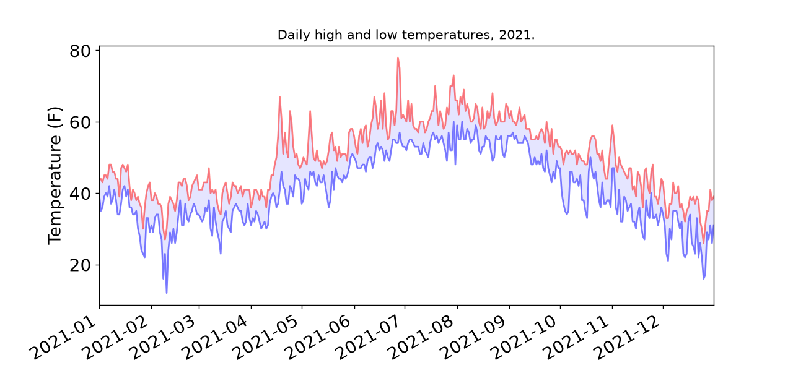
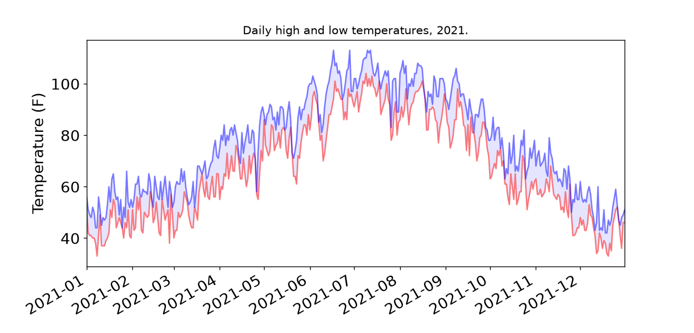
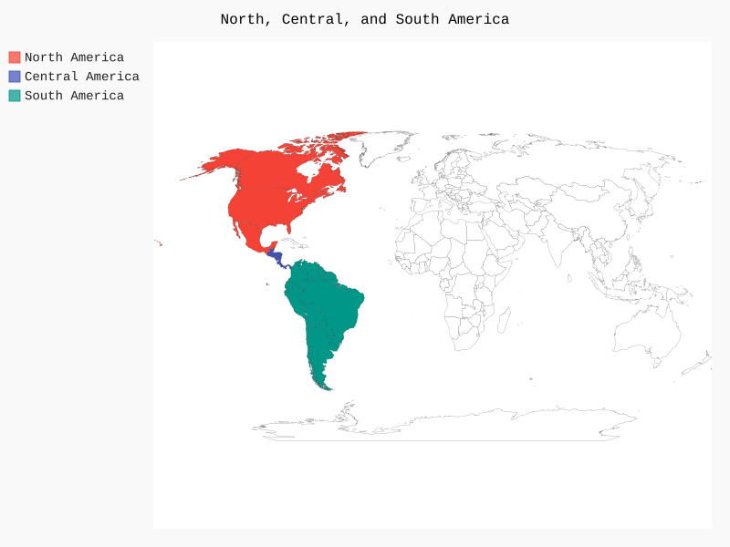
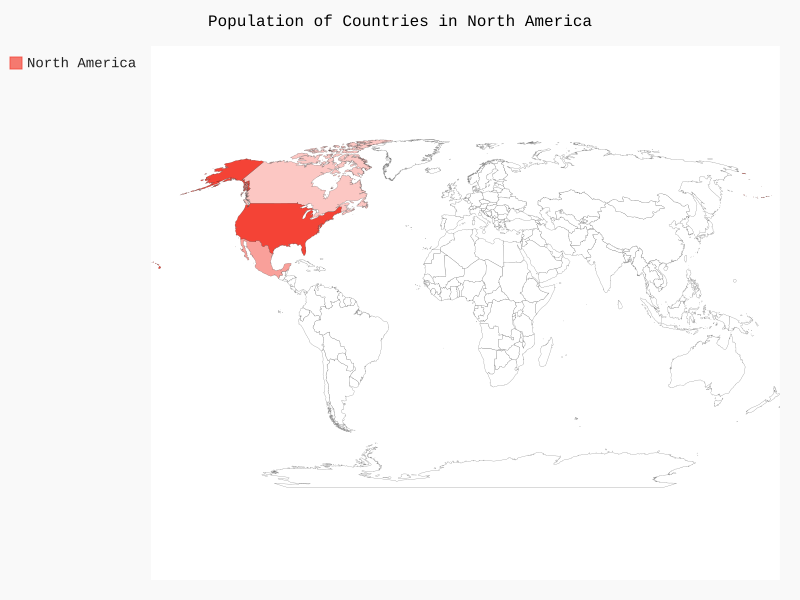
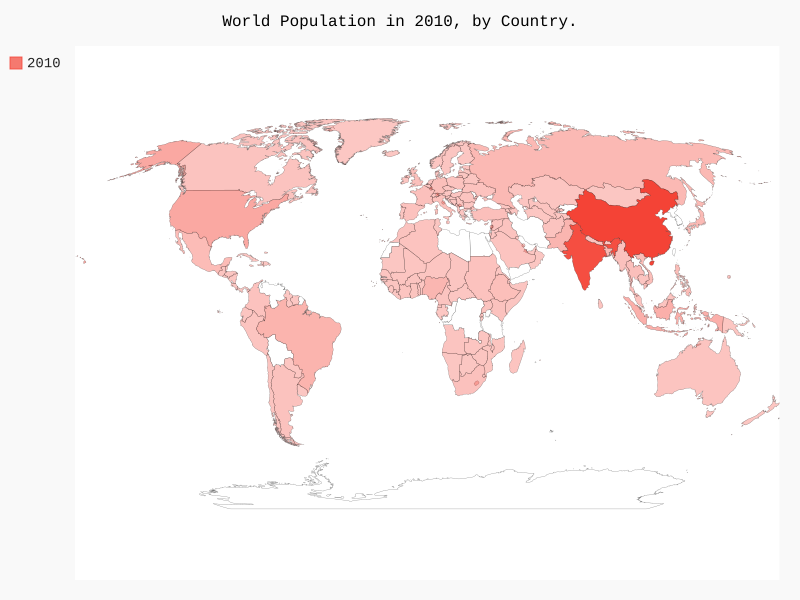

## 🖼 Sample Output

**Matplotlib**

- Sitka high/low temperatures:

  

- Death Valley high/low temperatures:

  

**Pygal — world maps**

- Americas highlighted:

  

- North America populations:

  

- World populations:

  

## 📦 Libraries Used

| Library                                              | Used for                                                                 |
| ---------------------------------------------------- | ------------------------------------------------------------------------ |
| `csv`                                                | Reading tabular weather data (`.csv` files) row by row                   |
| `json`                                               | Reading structured population data (`.json` files)                       |
| `datetime`                                           | Parsing date strings into `datetime` objects for plotting on a time axis |
| `matplotlib.pyplot`                                  | Plotting line charts and filled areas (weather highs/lows)               |
| `pygal`                                              | Rendering `.svg` bar/map charts (population by country)                  |
| `pygal_maps_world.maps`                              | Provides the world map chart type (`pygal_maps_world.maps.World`)        |
| `pygal_maps_world.i18n` (`country_codes`)            | Converts country names to the ISO codes Pygal's world map expects        |
| `pygal.style` (`LightColorizedStyle`, `RotateStyle`) | Customizing chart color themes                                           |

## 📁 Files

| File                  | Description                                                                          |
| --------------------- | ------------------------------------------------------------------------------------ |
| `highs_lows.py`       | Plots daily high & low temperatures from `sitka_weather_2021.csv` (Matplotlib)       |
| `americas.py`         | Pygal world map — highlights North & South American countries                        |
| `countries.py`        | Loads and prints the list of country codes Pygal's world map recognizes              |
| `country_codes.py`    | Helper module — maps a country name to its ISO 3166-1 alpha-2 code                   |
| `na_populations.py`   | Pygal world map — population of North American countries from `population_data.json` |
| `world_population.py` | Pygal world map — population of every country in the world, grouped into color bands |
